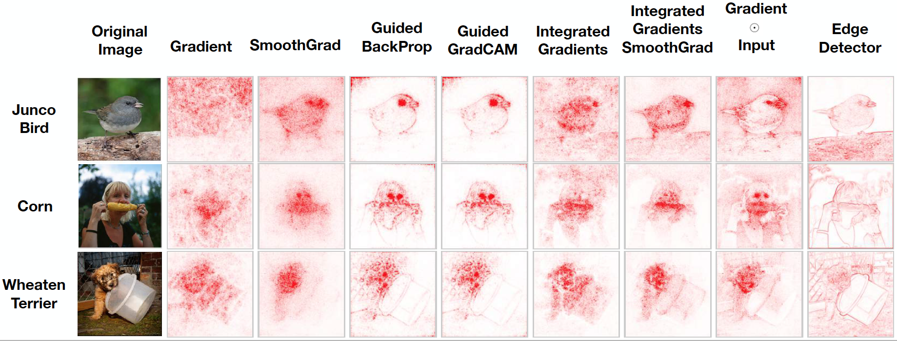
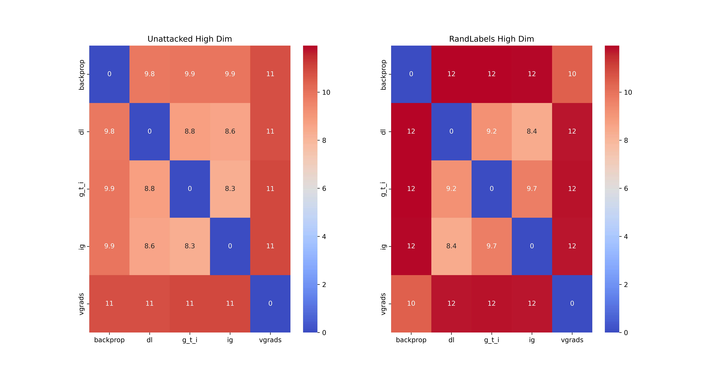
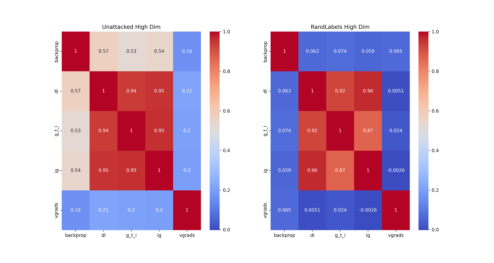
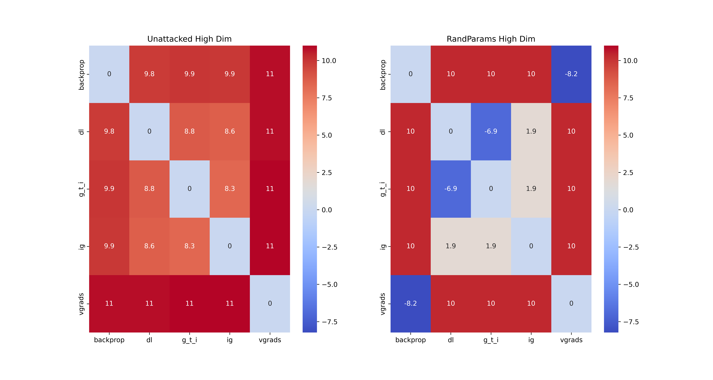
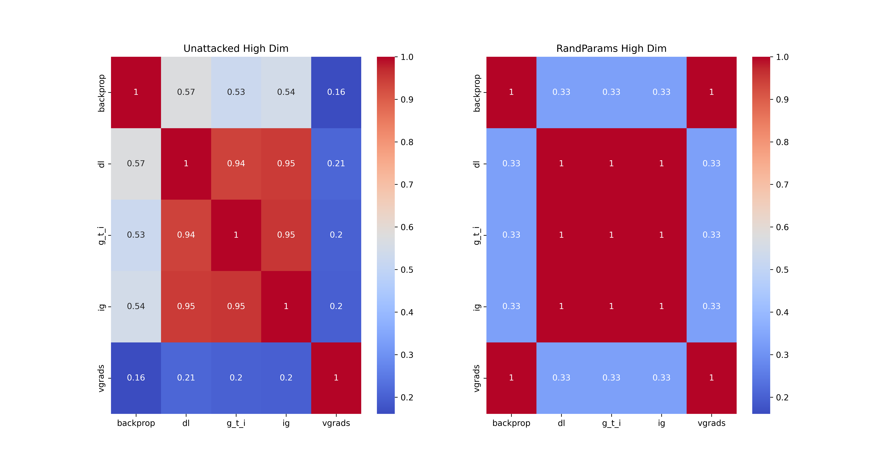
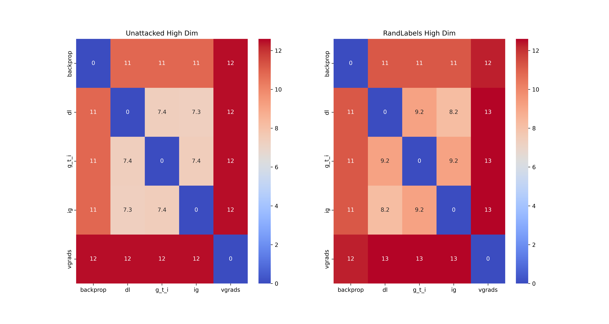
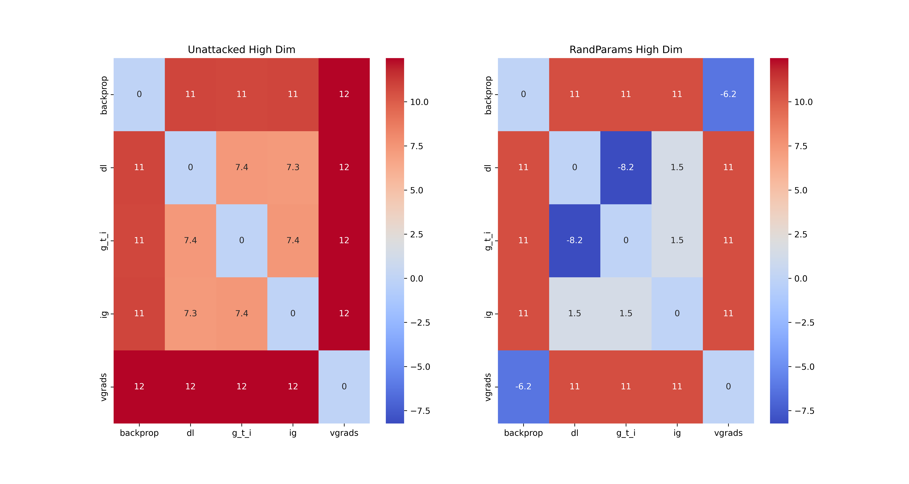

# Abstract
The research presented in the post centers on comparing different gradient-based introspection techniques and their responses to adversarial attacks in image classification tasks. By analyzing the behavior of these techniques under normal and attack scenarios, the study aims to understand the potential of combining different methods for enhanced detection of adversarial attacks. The experiments use two benchmark datasets, MNIST and CIFAR-10, and employ various attacks, including random label and parameter attacks.

In addition to introspection techniques, the blog post delves into the practical aspects of implementing these methods, discussing the challenges and limitations encountered with different AI frameworks. The results of the experiments are illustrated with heatmaps, scatterplots, and 3D visualizations, providing a comprehensive view of the effectiveness of different introspection methods under various conditions. The post concludes with a reflection on the limitations of the study and suggests avenues for future research in the field of XAI.

# Introduction
In this day and age of AI and data, the reliance on AI models for various tasks has been increasing. Currently, there are many kinds of AI models, with the choices ranging from complex deep neural network architectures to simpler models, such as decision trees. The choice behind using a model depends on the task at hand. For this blog, we will be focusing on neural network architectures that are used for image classification.  

Images can be seen as a collection of many pixels arranged in a grid. Each of these pixels have a mathematical value to represent their colour. Due to this, images are a complex mathematical data format that needs to be processed by AI models in order to interpret and analyse the information that the image represents. (Convolutional) Neural networks have been shown to be especially good at such tasks [[1]](http://yann.lecun.com/exdb/publis/pdf/lecun-iscas-10.pdf).  

This however poses a concern. Neural networks are complicated AI models that rely on mathematical functions and values that allow the network to 'learn' or 'understand' the information in the image. This makes their behaviour extremely difficult to interpret, as they just use the pixel information, which is just a bunch of numbers, and apply mathematical transformations to them in order to complete the given task. This nature of neural networks has led to them being distinguished as 'black box' models, since their inner functioning is not easy to explain.  

There are a number of methods that were introduced in order to make neural networks more explainable. Such methods are known as introspection techniques, since they allow us to look at the logic behind the numbers and help us understand the functioning of the neural network better.  

Introspection techniques and the ability to explain a model's behaviour was a significant breakthrough in the field of eXplainable AI (XAI). It did, however pose a question on how reliable these introspection techniques themselves were. A number of experiments were conducted on these methods, such as a sanity check of saliency maps [[2]](https://arxiv.org/abs/1810.03292) which showed that some of these techniques only worked as an 'edge detector' and did not actually do the task of explaining the model's behaviour. This can be seen in the picture below, taken from the same research paper.

 

    

With that, we can now come to the idea behind our research. There exist a number of introspection techniques currently. Each one is either a variation or a completely different technique altogether. Due to this, each introspection technique also tends to explain a model's behaviour differently. This led us to ponder the idea of comparing different techniques together and seeing how they respond to attacks in the input. If one type of introspection technique can be fooled by a certain attack and another one is resistant to the same, combining these techniques could help with detecting adversarial attacks. 

For our project, we have focused on a number of gradient-based introspection techniques. We will be comparing the saliency maps and its values generated by these methods for the correct inputs and for adversarial inputs. This will allow us to detect correlations or patterns, helping us better understand if the idea of a combination of introspection techniques would work in practice. Along with some examples, we will also present some visualizations for this purpose (such as the data distribution). For the sake of brevity, this blog post will be restricted to our results for the CNN model only. Along with that, we will be presenting only the results from our attempts to attack the model with random labels and *cascading* random parameter attacks. Here is an overview of our python notebooks containing all of our final results:

**Heatmaps**:
- [Cifar10/CNN](https://code.ovgu.de/ai-lab/student-projects/2023-summer-term/xai-fooling-detection/-/blob/088364f4c466b4ce7b2dabde9aed9200892a28c4/pytorch/NB_Heatmaps/Cifar_CNN_Heatmaps.ipynb)
- [Cifar10/MLP](https://code.ovgu.de/ai-lab/student-projects/2023-summer-term/xai-fooling-detection/-/blob/088364f4c466b4ce7b2dabde9aed9200892a28c4/pytorch/NB_Heatmaps/Cifar_MLP_Heatmaps.ipynb)
- [Mnist/CNN](https://code.ovgu.de/ai-lab/student-projects/2023-summer-term/xai-fooling-detection/-/blob/088364f4c466b4ce7b2dabde9aed9200892a28c4/pytorch/NB_Heatmaps/Mnist_CNN_Heatmaps.ipynb)
- [Mnist/MLP](https://code.ovgu.de/ai-lab/student-projects/2023-summer-term/xai-fooling-detection/-/blob/088364f4c466b4ce7b2dabde9aed9200892a28c4/pytorch/NB_Heatmaps/Mnist_MLP_Heatmaps.ipynb)
- [SSIM (All dataset/model combinations)](https://code.ovgu.de/ai-lab/student-projects/2023-summer-term/xai-fooling-detection/-/blob/088364f4c466b4ce7b2dabde9aed9200892a28c4/pytorch/NB_Heatmaps/ssim%20heatmaps.ipynb)

**Distributions**:
- [Cifar10/CNN](https://code.ovgu.de/ai-lab/student-projects/2023-summer-term/xai-fooling-detection/-/blob/088364f4c466b4ce7b2dabde9aed9200892a28c4/pytorch/NB_Distributions/Cifar_CNN_Distributions.ipynb)
- [Cifar10/MLP](https://code.ovgu.de/ai-lab/student-projects/2023-summer-term/xai-fooling-detection/-/blob/088364f4c466b4ce7b2dabde9aed9200892a28c4/pytorch/NB_Distributions/Cifar_MLP_Distributions.ipynb)
- [Mnist/CNN](https://code.ovgu.de/ai-lab/student-projects/2023-summer-term/xai-fooling-detection/-/blob/088364f4c466b4ce7b2dabde9aed9200892a28c4/pytorch/NB_Distributions/Mnist_CNN_Distributions.ipynb)
- [Mnist/MLP](https://code.ovgu.de/ai-lab/student-projects/2023-summer-term/xai-fooling-detection/-/blob/088364f4c466b4ce7b2dabde9aed9200892a28c4/pytorch/NB_Distributions/Mnist_MLP_Distributions.ipynb)
- [SSIM (All dataset/model combinations)](https://code.ovgu.de/ai-lab/student-projects/2023-summer-term/xai-fooling-detection/-/blob/088364f4c466b4ce7b2dabde9aed9200892a28c4/pytorch/NB_Distributions/ssim%20distributions.ipynb)

# Methods
To achieve our goal of potentially 'fooling' introspection techniques reliably, we have focused on a mix of model types, datasets, as well as introspection methods. In this section, we will dive deeper into our choice and reason for going with each one.

## Datasets
The choice of dataset for deep learning tasks is quite crucial as any error or issue within the dataset will propagate through the entire learning and make the task difficult for the model to succeed in. To ensure that problems related to our data are kept at a minimum, we went with the following two datasets, which are often used as simple benchmarks for image classification tasks:
### MNIST
The MNIST dataset is a widely used benchmark in the field of machine learning. It consists of 28x28 pixel grayscale images of handwritten digits (0 to 9). MNIST serves as a foundational dataset for training and testing various image processing systems. It contains 60,000 training images and 10,000 test images, making it a standard choice for beginners and researchers to evaluate the performance of different classification algorithms. Due to its simplicity and small size, MNIST is often used for prototyping and testing new machine learning models and algorithms. [[3]](http://yann.lecun.com/exdb/mnist/)

    

### CIFAR10
The CIFAR-10 dataset is another popular dataset used for object recognition tasks. It contains 60,000 32x32 pixel color images across 10 different classes, including common objects like cars, birds, and cats. Each class has 60,000 images split into 50,000 training images and 10,000 test images. CIFAR-10 is more challenging than MNIST due to its colorful nature and the presence of various object categories. It serves as a suitable dataset for evaluating the performance of machine learning models, especially in the context of real-world image recognition applications. Researchers often use CIFAR-10 to assess the robustness and accuracy of deep learning models in handling diverse and complex visual data. [[4]](https://www.cs.toronto.edu/~kriz/cifar.html)

    

 <!--  -->

## Model Types
There are a number of neural network models which can be applied to image classification tasks. We have decided to opt for the following two:
### Multi-Layer Perceptron (MLP)
Multi-layer Perceptrons (MLPs) are a fundamental type of artificial neural network consisting of multiple interconnected layers of nodes, including an input layer, one or more hidden layers, and an output layer. Each node in the hidden layers applies a weighted sum of its inputs, followed by an activation function, allowing MLPs to model complex non-linear relationships in data. MLPs are versatile and can be applied to various tasks, including regression and classification problems. They learn from labeled data during training, adjusting the weights to minimize prediction errors. Due to the simplicity and low-resolution datasets used, MLPs were an option for our project. [[5]](https://towardsdatascience.com/multilayer-perceptron-explained-with-a-real-life-example-and-python-code-sentiment-analysis-cb408ee93141)

Our MLP models for both datasets consist of an input layer with parameters corresponding to the input dimensions, followed by one fully-connected layer and an output layer with 10 output channels corresponding to the number of classes in both the datasets used. 

### Convolutional Neural Networks (CNNs)
Convolutiional Neural Networks are specialized deep learning models for processing grid-like data, such as images. CNNs are characterized by their use of convolutional layers, which apply filters or kernels to input data to extract local patterns and features. These filters enable the network to automatically learn hierarchical representations of the input, starting from basic features like edges and textures and progressing to complex structures and objects. In CNNs, convolutional layers are followed by activation functions and pooling layers, which further enhance the network's ability to capture relevant features while reducing the spatial dimensions of the data. Due to this ability to extract meaningful features from raw pixel data, CNNs excel in computer vision tasks, such as image recognition and object detection, making them an ideal choice for our project. [[6]](https://towardsdatascience.com/convolutional-neural-networks-explained-9cc5188c4939)

Our CNN models for both datasets have a similar architecture. 
Starting off with an input layer with 1 or 3 input channels (indicating RGB color channels of the input images).
Three sets of convolutional blocks, each followed by ReLU activation functions. Each convolutional block contains two convolutional layers with varying input channels, and output channels as 32, 64, and 128 respectively for the three sets of blocks. 
After each set of convolutional blocks, there's a MaxPooling layer with pool size 2x2, reducing the spatial dimensions by half and stride 2, indicating the pool window moves two pixels at a time.
After the convolutional and pooling layers, the output is flattened into a 1D vector.
The flattened vector is then passed through three fully connected (dense) layers.

## Introspection Techniques
There are a number of introspection methods available today. These methods can be categorised into various types, such as input-based, activation-based, gradient-based, model-agnostic methods, among others. We have primarily focused on **input-based techniques** in this project. The techniques chosen by us for the project are:

### Vanilla Gradients
Vanilla Gradients, often referred to as Saliency Maps, are a fundamental technique for interpreting neural network predictions. This method involves computing gradients of the output prediction with respect to the input data. In simpler terms, it identifies how sensitive the prediction is to small changes in the input features. By highlighting areas where the gradient values are high, Saliency Maps indicate which parts of the input image strongly influence the network's decision. Despite its simplicity, this technique provides valuable insights into the model's attention, revealing which features are essential for a particular prediction. [[7]](https://www.geeksforgeeks.org/what-is-saliency-map/)

### Guided Backpropagation
Guided Backpropagation is a technique for visualizing the features of an image that are most important to a neural network's prediction. It is based on the idea that neurons in a neural network act as detectors for particular image features. When a neuron is activated, it means that it has detected a particular feature in the input image. It works by combining the forward and backward passes of the network in a way that only allows positive gradients to flow. This means that the output of Guided Backpropagation is a map of the image that highlights the pixels that contribute the most to the network's prediction. [[8]](https://www.codingninjas.com/studio/library/guided-backpropagation)

### DeepLIFT
DeepLIFT is a technique used to understand how changes in input data affect the output of a neural network. It stands for "Deep Learning Important FeaTures" and is designed to uncover which parts of the input data are crucial for a specific prediction. DeepLIFT works by tracing the neural network's computations backward, highlighting the important features by comparing different inputs and outputs. By doing this, it reveals the specific elements in the input data that have the most significant impact on the neural network's decisions. [[9]](https://towardsdatascience.com/explainable-neural-networks-recent-advancements-part-3-6a838d15f2fb)

### Gradient*Input
GradientsInputs, also known as Gradient times Input, is a technique used to interpret neural networks by examining the relationship between input data and gradients during the training process. It calculates the product of the gradients (which represent how the network's prediction changes concerning the input) and the input values themselves. This multiplication highlights the elements in the input data that have the most influence on the network's predictions. By focusing on these influential elements, GradientsInputs provides insights into which features are most important for the neural network's decision-making. [[10]](https://towardsdatascience.com/basics-gradient-input-as-explanation-bca79bb80de0)

### Integrated Gradients
Integrated Gradients work by examining the model's behavior concerning different input features. Integrated Gradients calculate the integral of the gradients along the straight path from a baseline (usually an input with zero influence) to the actual input. This approach helps to understand how each feature contributes to the prediction. By integrating over this path, Integrated Gradients quantifies the importance of individual features, offering a comprehensive view of their impact on the model's outputs. [[11]](https://towardsdatascience.com/explainable-neural-networks-recent-advancements-part-4-73cacc910fef)

## Attack Variants
In order to test the robustness and versatility of our explanation techniques against adversarial attacks, we have opted for two kinds of input based attacks to compare our non-attacked model with. These are:
### Random Label Attack
In this attack, the adversary deliberately assigns random or incorrect labels to the training data used for model training. By introducing these noisy or misleading labels, the attacker aims to disrupt the learning process and compromise the model's performance.

Random labels attacks are significant in assessing a model's resilience against data poisoning attacks. When a model is trained on data contaminated with random labels, it hampers the model's ability to learn meaningful patterns, leading to degraded accuracy and potentially misleading predictions. Defending against random labels attacks requires robust data preprocessing, anomaly detection techniques, and careful validation methods to identify and filter out noisy or maliciously injected data points. [[12]](https://arxiv.org/pdf/2002.03018.pdf)

### Random Parameters Attack
In this attack, instead of manipulating the training data, the attacker perturbs the model's internal parameters randomly. By injecting random noise into the model's weights, biases, or other learnable parameters, the attacker aims to destabilize the learning process and compromise the model's performance. [[13]](https://arxiv.org/abs/2203.10502)

Random parameters attacks are challenging to defend against because they exploit vulnerabilities in the optimization algorithms used for training machine learning models. The injected noise disrupts the optimization landscape, making it harder for the algorithm to converge to an optimal solution. This can lead to reduced accuracy, increased training time, or even complete failure of the model to learn the underlying patterns in the data.

We used two forms of Random Parameter attacks in our tests, namely Cascading and Sequential Random Parameter attacks.
In a cascading random parameters attack, adversaries iteratively inject random noise into the model's parameters during multiple training stages. This multi-step approach intensifies the disruption caused by random perturbations, making it harder for the model to converge to a stable solution. Cascading random parameters attacks exploit the vulnerability of machine learning models to cumulative parameter noise, significantly impacting their performance and reliability.

In a sequential random parameters attack, adversaries perturb the model's parameters sequentially, one at a time, during different training epochs. By introducing noise in a step-by-step manner, attackers aim to exploit the vulnerability of the training process to gradual parameter changes. Sequential random parameters attacks can deceive optimization algorithms, leading to suboptimal convergence and reduced model accuracy. 

## Dimensionality Reduction
The following dimensionality reduction methods were used in order to compare the attacked and non-attacked variants of the explanations. They were all used to reduce the number of dimensions down to 2 in order to visualize the distributions for a better understanding of the data. 
### Uniform Manifold Approximation and Projection (UMAP)
UMAP is a dimensionality reduction technique used for visualizing high-dimensional data in lower-dimensional spaces. Unlike traditional methods, such as PCA, UMAP preserves both local and global data structures. It achieves this by constructing a high-dimensional graph representation of the data and then optimizing a low-dimensional representation that captures the underlying manifold structure. UMAP is particularly useful for exploring complex datasets, revealing patterns, and identifying clusters in a visually appealing and interpretable manner. [[14]](https://umap-learn.readthedocs.io/en/latest/)

### t-Distributed Stochastic Neighbor Embedding (t-SNE)
t-SNE (t-Distributed Stochastic Neighbor Embedding) is another popular technique for visualizing high-dimensional data. It focuses on preserving pairwise similarities between data points in the lower-dimensional space. t-SNE maps similar data points close to each other in the reduced space, making it effective for revealing clusters and patterns in the data. It is especially useful for visualizing data with intricate structures like natural language processing embeddings or genomic data. However, t-SNE is computationally intensive and may not always preserve the global structure of the data. [[15]](https://towardsdatascience.com/t-sne-clearly-explained-d84c537f53a)

### Kernel Principal Component Analysis (kPCA)
kPCA is a non-linear extension of traditional PCA. PCA finds linear combinations of input features to project data into a lower-dimensional space, while kPCA uses kernel functions to capture non-linear relationships. By mapping the data into a higher-dimensional space (the feature space) and applying PCA in that space, kPCA can effectively capture complex patterns and structures within the data. It is particularly useful when dealing with data that exhibits non-linear relationships and can help reveal hidden patterns that linear techniques like PCA might miss. However, the choice of the kernel function is crucial and requires careful consideration based on the characteristics of the data being analyzed. The kernel functions we have used in our project are linear, polynomial, and cosine kernels. We decided not to opt for sigmoid kernels because it did not work well empirically. [[16]](https://people.eecs.berkeley.edu/~wainwrig/stat241b/scholkopf_kernel.pdf)

## Similarity Measures
Next step is to compare the similarity between the explanations generated by the techniques for each of the cases mentioned above. To do so, we have decided to go with a number of simple distance and similarity metrics for pixel-by-pixel comparison. A full list of the metrics used are as follows:
### Euclidean Distance
Euclidean Distance is a measure of the straight-line distance between two points in a multi-dimensional space. It is calculated as the square root of the sum of squared differences between corresponding coordinates of the points. Euclidean distance is widely used in various machine learning applications. [[17]](https://www.analyticsvidhya.com/blog/2020/02/4-types-of-distance-metrics-in-machine-learning/)

### Manhattan Distance
Manhattan Distance, also known as City Block Distance or Taxicab Distance, calculates the distance between two points as the sum of the absolute differences of their coordinates. It represents the distance a vehicle would travel along the grid-like streets of a city to reach from one point to another. [[17]](https://www.analyticsvidhya.com/blog/2020/02/4-types-of-distance-metrics-in-machine-learning/)

### Minkowski Distance
Minkowski Distance is a generalization of both Euclidean and Manhattan distances. It allows the distance metric to be adjusted using a parameter *p*, which determines the order of the distance equation. [[17]](https://www.analyticsvidhya.com/blog/2020/02/4-types-of-distance-metrics-in-machine-learning/)
When p=1, it becomes Manhattan distance, and when p=2, it becomes Euclidean distance. Minkowski distance incorporates different distance measures based on the chosen value of p. For our tests, we have chosen the value of p as 3.

### Chebyshev Distance
Chebyshev Distance measures the maximum absolute difference between the coordinates of two points along any dimension. It is calculated as the largest absolute difference between corresponding coordinates, making it sensitive to the most significant deviation between the points. [[18]](https://people.revoledu.com/kardi/tutorial/Similarity/ChebyshevDistance.html)

### Cosine Similarity
Cosine Similarity measures the cosine of the angle between two non-zero vectors in an inner product space. It is often used to assess the similarity between two vectors, irrespective of their magnitudes. Cosine similarity ranges from -1 (completely dissimilar) to 1 (completely similar). [[19]](https://www.geeksforgeeks.org/cosine-similarity/)

### Structural Similarity Index (SSIM)
SSIM is a metric used to quantify the similarity between two images. It considers luminance, contrast, and structure to evaluate the perceptual difference between the images. SSIM produces a value between -1 and 1, where 1 indicates a perfect similarity between the images. Comparison of the similarity between the various introspection techniques was done on both high- and low-dimensional spaces for all the aforementioned metrics, but only on high-dimensional space for SSIM. The reason for this was purely due to time constraints. [[20]](https://medium.com/srm-mic/all-about-structural-similarity-index-ssim-theory-code-in-pytorch-6551b455541e)

## Practical Implications
### Sample Size
The datasets used both contain a large number of images. These were all used to train our models, but using them for comparing our explanation metrics would have been unfeasible. To make it easier to interpret the explanations, we decided to go with a smaller sample size of 300 images. We also conducted tests on 100, 200 and 1000 images, and found that the results were highly comparable. This was our reason for going with 300 images as we could have a sample size large enough so that outliers do not have a significant influence on our tests, while remaining small enough to not affect our interpretability of the results.

### TensorFlow and Tf-explain
There are a couple of frameworks used in neural network learning that are the most popular. One of these frameworks is TensorFlow [[21]](https://www.tensorflow.org). TensorFlow consists of a library known as 'Tf-explain' [[22]](https://tf-explain.readthedocs.io/en/latest/) which provides implementations for some of the most widely used explanation/introspection techniques.
Due to previous personal experience with TensorFlow, tf-explain was our go-to choice for the project. However, during the course of the project, we ran into a number of issues with the library. We constantly ran into memory leak issues on some explanations, which meant that scaling our attempts became extremely difficult. Secondly, a lot of results provided by the explanation techniques ended up being unreliably inaccurate. On closer inspection of the library, we found out that the library was not being actively maintained, which could be the reason for the problems we have run into. 
As correct implementation of the explanation techniques is key to our project, and implementing all of the techniques mentioned above from scratch would require quite a bit of additional effort, we decided to switch to another framework.
We decided to go for PyTorch [[23]](https://pytorch.org/get-started/locally/) as it includes the Captum library [[24]](https://captum.ai), which was being actively maintained and included all the techniques that we required. This set our project timeline back by quite a bit, as we had to migrate everything that we had already done in TensorFlow to PyTorch and Captum.

# Results
The following section contains the results of the experiments that we conducted on the two sample datasets. We will compare the explanation techniques and their results for attacked and non-attacked versions in high- and low-dimensional data space. The first sub-section focuses on the findings of the experiments on the MNIST dataset, while the latter handles the CIFAR10 dataset. The sub-sections start by introducing the grids generated by the introspection techniques on non-attacked data on high-dimensional data space for comparison with the attacked versions of the same. Consequently, we perform a similar comparison on a low-dimensional data space. A number of visualizations of the data space is included to make the results more interpretable.

## MNIST
In this section, we highlight the results of the tests on the MNIST dataset. Firstly, we look at the performance of the chosen introspection techniques on our CNN model for the non-attacked variant. We have created grids using the outputs from these techniques and visualized the 'correct' saliency maps below:  

**Saliency maps for MNIST - No Attack**

Next, we look at the saliency maps generated due to the random label attack being performed on our CNN model. The results of this are as follows:

**Saliency maps for MNIST - Random Labels Attack**  

Given the images above, one can conclude that the explanation results created using DeepLIFT, Gradients*Inputs (GTI) and IntegratedGradients (IG) are somewhat similar for the attacked and non-attacked variants. However, the results of Backpropagation and vanilla gradients tend to deviate more from their non-attacked version in the case of an attack. To confirm this, we have taken all possible pairs of explanation techniques and computed several metrics for each pair. The figure below uses the average euclidean distance metric after a logarithm of base 2 has been applied (This means an increase by 1 represents a doubling of the value). Other distance functions have shown similar results and can be found in the notebooks.

**Comparison of Heatmaps for MNIST - Correct vs Random Labels**

In both cases we can see that DeepLIFT/GTI/IG paired with either vanilla gradients or Backpropagation produces higher values (the "outer ring"), while comparing them to one another yields lower values (the "inner ring"). This is what we expected to see, given the similar results they produced in the saliency maps seen above. This also holds for the attacked version (random labels). Note that the diagonal elements of this heatmap will always be 0 since the values describe the distance of one saliency map to itself.

When comparing the values of the heatmaps, the most relevant increase is between Backpropagation and DeepLIFT/GTI/IG where the euclidean distance between the grids have increased by a factor of four (note the logarithmic scale in the heatmaps). 

Instead of distance functions, one can also consider using a similarity measure, such as SSIM[[25]](https://arxiv.org/pdf/2006.13846.pdf). Note that since SSIM is a similarity measure, a higher value represents a higher similarity and a lower one a higher dissimilarity:

**Comparison of SSIM Heatmaps for MNIST - Correct vs Random Labels**

Doing a similar comparison to a cascading random parameters attack, where we have randomized the weights of the entire neural network, we can observe that backpropagation and vanilla gradients look exactly the same, which can also be seen when observing the heatmaps.

**Saliency map for MNIST - Random Parameter Attack**

Similar to the heatmap produced above using the Euclidean distances (*on a logarithmic scale*) between the introspection techniques, below is a visualization for the non-attacked vs Random Parameter attacked explanations:

**Comparison of Heatmaps for MNIST - Correct vs Random Parameter Attack**

Additionally, we have created heatmaps for the non-attacked and random parameter attack explanations using the similarity metric - SSIM:

**Comparison of SSIM Heatmaps for MNIST - Correct vs Random Parameter Attack**

As can be seen by the low log euclidean distance values and the high SSIM similarity, DeepLift, GTI, and IG appear to be even more similar to one another. This also applies to vanilla gradients and their similarity to Backpropagation. This matches the expectations one has from observing the grids above.

This shows that certain pairs of introspection techniques behave in similar ways on attacks. While this high dimensionality representation of our data benefits structural similarity metrics like SSIM, classic distance measure like euclidean distance can produce unwanted results if there has been a shift in the input by just one pixel. To improve performance of the distance metrics, one can reduce the dimensionality of the grids by using techniques like Kernel Principle Component Anaylsis (kPCA), UMAP or t-SNE and plot the lower dimensional feature space.

### Dimensionality Reduction
A major advantage of reducing the dimensionalities from 28*28=784 (input image resolution) to 2 is that we can visualize our data in this projected space (either as a distribution in a 3d plot or as a scatterplot). This allows us to get insights about the high-dimensional structure of the data, in a simpler way. We have applied UMAP, t-SNE, and kPCA (with various kernels) dimensionality reductions to our data. These have been visualized below.

To showcase the best working option out of the three mentioned, the following plot shows the UMAP reduced representation of No attack (left), RandLabels attack (middle), RandParams attack (right) for 300 images (n=300). The visualization for the other methods can be found in the attached notebook. 

**Scatterplot of UMAP-reduced Explanations for MNIST**

This can also be visualized in 3-d with the points mapped to a multi-variate distribution (This might take a few seconds to load...):

**3-d Visualization of UMAP-reduced Explanations Data Distribution**

As can be gathered from this data, in most cases the non-attacked grids are present in locations of the feature space where no attacked version is. All of these tests have been conducted using the same reducer object and the same random seed for uniformity.

### Compare (Non-)Attacked Distance Distributions
Earlier we have looked at the change in distances between a non-attacked and attacked version. Instead of summing or averaging the distances, one can also try to fit the distance values to a distribution. In the following sections, we proceeded to:
1. Take all possible pairs of explanation techniques 
2. For each pair:
    1. Calculate the distances between the two explanation techniques, calculate the log of that, and model a normal distribution given the values
    2. Plot the distributions

This was repeated to create distributions for all variants (no-attack, random labels attack, random parameters attack).

**Distributions for MNIST - No Attack**

**Distributions for MNIST - Random Labels Attack**

Comparing the distributions for no attack to the ones for the random label attack, we find the strongest increases in the mean is present when comparing backpropagation to DeepLIFT - DL (2.05), GTI (1.87), and IG (1.94). In contrast to our expectations GTI paired with IG also yielded a relateively high mean increase with 1.35. Most of the distributions show an increase in the standard deviation, which is also something we have expected.

**Distributions for MNIST - Random Parameter Attack**

For the random parameter attack we again see an increase in the mean for backpropagation vs. DL/GTI/IG, although not as drastic as before. However it is worthy to mention that these are the only means that have increased compared to the random label attack. Looking at backpropagation vs. vanilla gradients we find that the grids for both methods are in fact identical for a fully randomized CNN network, showing a mean and standard deviation of 0. A similar behaviour can be observed when comparing DL to GTI which also have a mean of 0 but a standard deviation of 0.07. Comparisions between DL vs IG and DL vs GTI have the highest standard deviations.

While these results imply that there are noticable differences for attacked / non-attacked models, it is important to consider that MNIST is a very simple dataset. The vast sparsity in MNIST and its grayscale nature (single colour channel) are simplifications which do not occur in many real world datasets. To adress this issue we have also considered the CIFAR10 dataset.

## CIFAR10
Looking at the results of the explanation techniques for CIFAR10, it is noticeable that they cannot be interpreted as intuitively as the MNIST ones. Also similar to MNIST, DL/GTI/IG produce similar looking, but not identical, saliency maps:

**Saliency maps for CIFAR10 - No Attack**

Next, let us look at the saliency maps produced by our model for CIFAR10 when attacked (Random Label and Random Parameter attacks)

**Saliency maps for CIFAR10 - Random Label Attack**

**Saliency maps for CIFAR10 - Random Parameter Attack**

As with MNIST, we consider all pairs of explanation techniques and calculate the difference between pairs of them using various metrics. Here we again provide the results for the euclidean distance and the SSIM similarity metric. Other metrics did not provide extra descriptive value and have hence been left out. The complete results can be found in the linked notebooks. 

**Comparison of Heatmaps for CIFAR10 - No-Attack vs Random Labels Attack**

Similar to MNIST: We can again see that IG/GTI/DL have roughly the same distance to Backpropagation and vanilla gradients. The difference here is that there is no significant increase in distance as was the case for the MNIST dataset results.

A similar pattern can also be found when applying SSIM for the same scenario:

**Comparison of SSIM Heatmap for CIFAR10 - No-Attack vs Random Labels Attack**

Swapping the random labels attack with the cascading random parameters attack yielded similar results. Randomizing parameters for the entire network, as done for MNIST, leads to the following euclidean distances (left: No attack, right: Random Parameters)

**Comparison of Heatmaps for CIFAR10 - No-Attack vs Random Parameter Attack**

As expected, SSIM shows similar results as above.

**Comparison of SSIM Heatmaps for CIFAR10 - No-Attack vs Random Parameter Attack**

### Dimensionality Reduction
Due to the larger resolution and RGB channels for CIFAR10, the amount of dimensions is much greater than for MNIST. Along with the channels axis, we have a total of 3072 (32x32x3) dimensions. 
The following plot shows UMAP reduced representation of No attack (left), RandLabels attack (middle), RandParams attack (right) for 300 images (n=300). 

**Scatterplot of UMAP-reduced Explanations for CIFAR10**

This can also be visualized in 3-d with the points mapped to a multi-variate distribution (This might take a few seconds to load...):

**3-d Visualization of UMAP-reduced Explanations Data Distribution**

Similar to our results for MNIST, we find that the lower dimensional representation for each attack differs substantially for one explanation method. 

### Compare (Non-)Attacked Distance Distributions
Similar to MNIST, we now compare the attacked and non-attacked variants of the distributions for CIFAR10.
Firstly, a visualization of the distribution for the non-attacked version:

**Distributions for No Attack**

Moving on to the attacked variants, we first present the distributions for the random label attack:

**Distributions for Random Label Attack**

Lastly, a view of the random parameter attacked model's distributions:

**Distributions for Random Parameter Attack**

Comparing the distributions for no attack to the ones for the random label attack, we find the strongest increases in the mean is present when comparing backpropagation to DL (2.05), GTI (1.87), and IG (1.94). In contrast to our expectations, GTI paired with IG also yielded a relateively high mean increase with 1.35. Most of the distributions show an increase in the standard deviation, which is in line with what was expected.

Similar to our findings for MNIST, the distribibutions confirm that vanilla Gradients paired with Backpropagation and DeepLIFT paired with GTI produce identical saliency maps, since the means and standard deviations for both pairs is equal to 0. While not being fully equal, it is worth noting that for DeepLift paired with Integrated Gradients as well as for GTI paired with Integrated gradients the mean has decreased by 7 on a logarithmic scale, describing a linear decrease by a factor of 128.

# Final thoughts
When looking at the results, it is important to recall that there have been many limitations and simplifications in place, which is why further tests on more complex datasets and deeper models are necessary. 

Firstly, due to time constraints, we have only focused on a small number of introspection techniques. This can be expanded to include more complex methods such as LIME, SHAP, LRP, etc. A variety of introspection technique categories and their combinations could further improve robustness of explainability for neural networks. It is also important to mention that the attacks used in this project would most likekly not occur in the real world since they require direct access to the model. More sophisticated attacks have to be investigated.

Especially for MNIST there have been measureable differences between the attacked and non-attacked versions which one can use for further research. For example: 
One could compute the lower-dimensional representation for the grids of the data for each explanation technique as we have shown with our scatter plots above. Then, on unseen data one could run the explainers again, reduce the dimensionality of the grids using the same reducer as for the previously seen data and then for each explanation technique calculate the probability that this newly calculated point in this lower dimension space originated from the distribution of the other points. If this is yielding promising results, one could think about building a classifier system on top of this, combining the probabilities for each explanation technique. 

It is also worth mentioning that the results for the simple MLP model were not as promising as the results for the more complex CNN architecture. An open area of research is to put the explanation methods and their combinations to test on a more complex model like a VGGNet. 

There are also a lot of hyperparemeters which can be tuned. This might lead to better or worse performance. One could, for example, decide to not reduce the dimensionality using t-SNE/UMAP/kPCA as drastically as we did, perhaps trading the ability to visualize them nicely for the preservation of information from the high-dimensional space.

Another approach which we considered but have not implemented due to lack of time is to reduce the dimensionality using a (Variational) AutoEncoder. The idea is to obtain a valuable latent space which can then be used for further analysis or downstream tasks. 

Also, our random parameters attack randomizes the parameters of the entire network. Research could be done on this by randomizing only parts of the network instead. This should have an impact on the explanations, and would be interesting to see how much it would differ from a fully randomized network.

Finally, with respect to all the limitations listed above, this project shows that there are certain correlations between the investigated explanation techniques which technically work in different ways for selected attacks one could use to detect fooling attempts.

# References
1. http://yann.lecun.com/exdb/publis/pdf/lecun-iscas-10.pdf
2. https://arxiv.org/abs/1810.03292 
3. http://yann.lecun.com/exdb/mnist/
4. https://www.cs.toronto.edu/~kriz/cifar.html
5. https://towardsdatascience.com/multilayer-perceptron-explained-with-a-real-life-example-and-python-code-sentiment-analysis-cb408ee93141
6. https://towardsdatascience.com/convolutional-neural-networks-explained-9cc5188c4939
7. https://www.geeksforgeeks.org/what-is-saliency-map/
8. https://www.codingninjas.com/studio/library/guided-backpropagation
9. https://towardsdatascience.com/explainable-neural-networks-recent-advancements-part-3-6a838d15f2fb
10. https://towardsdatascience.com/basics-gradient-input-as-explanation-bca79bb80de0
11. https://towardsdatascience.com/explainable-neural-networks-recent-advancements-part-4-73cacc910fef
12. https://arxiv.org/pdf/2002.03018.pdf
13. https://arxiv.org/abs/2203.10502
14. https://umap-learn.readthedocs.io/en/latest/
15. https://towardsdatascience.com/t-sne-clearly-explained-d84c537f53a
16. https://people.eecs.berkeley.edu/~wainwrig/stat241b/scholkopf_kernel.pdf
17. https://www.analyticsvidhya.com/blog/2020/02/4-types-of-distance-metrics-in-machine-learning/
18. https://people.revoledu.com/kardi/tutorial/Similarity/ChebyshevDistance.html
19. https://www.geeksforgeeks.org/cosine-similarity/
20. https://medium.com/srm-mic/all-about-structural-similarity-index-ssim-theory-code-in-pytorch-6551b455541e
21. https://www.tensorflow.org
22. https://tf-explain.readthedocs.io/en/latest/
23. https://pytorch.org/get-started/locally/
24. https://captum.ai
25. https://arxiv.org/pdf/2006.13846.pdf
